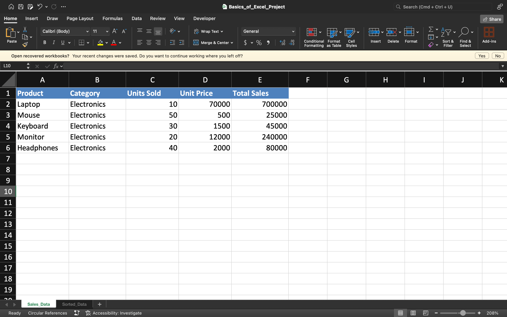
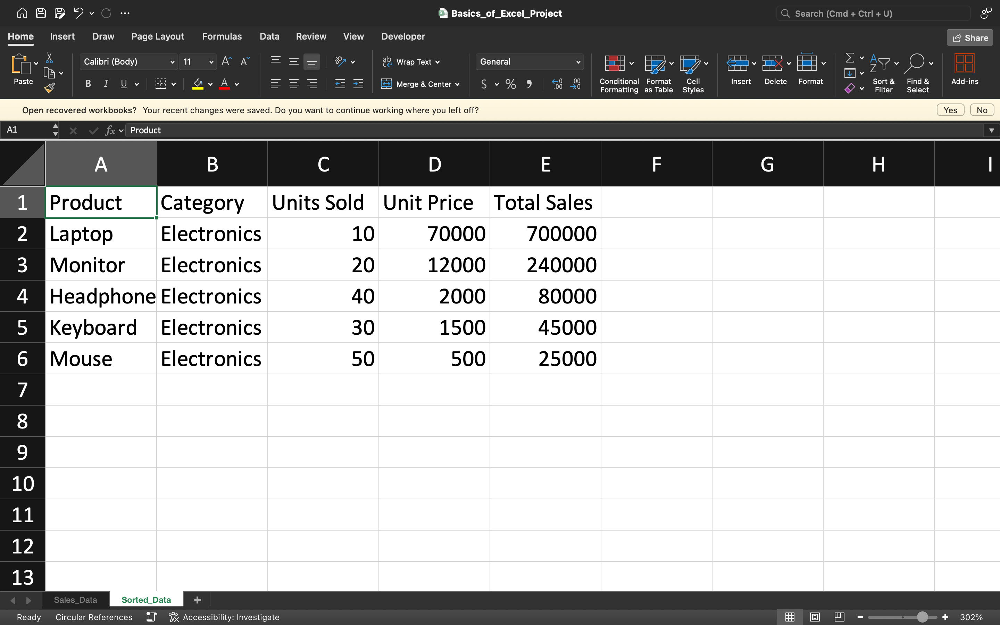

# 📊 Basics of Excel – Learning Project

## 📌 Overview
This project demonstrates **fundamental Excel skills** including:
- Data entry & formatting
- Using formulas & functions
- Sorting & filtering data
- Creating basic charts & graphs

It is part of my learning journey to strengthen my data handling and reporting skills.

---

## 📂 Files in this Repository
- `Basics_of_Excel_Project.xlsx` → Main Excel project file  
- `screenshot1.png` → View of raw dataset  
- `screenshot2.png` → View of sorted/filtered data

---

## 🛠 Skills Used
- Excel Functions: `SUM`, `AVERAGE`, `VLOOKUP`, `IF`
- Data Formatting & Validation
- Conditional Formatting
- Chart Creation

---

## 📷 Project Preview

